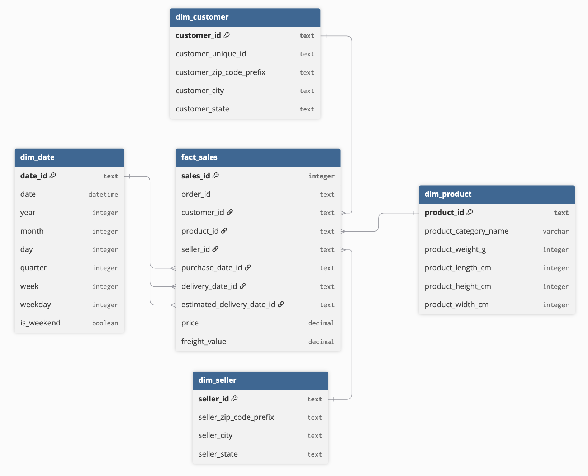

### Project description
This project contains a retail analytics warehouse I have build around the OLIST e-commerce dataset. 

### Warehouse structure
The analytical database is build using a star-schema structure where sales is the central business activity to be analyzed. Around the 

### Star-schema

Project structure
.
├── analysis
│   ├── delivery_performance.py
│   ├── product_category_performance.py
│   └── sales_performance.py
├── data
│   └── raw
│       ├── olist_customers_dataset.csv
│       ├── olist_geolocation_dataset.csv
│       ├── olist_order_items_dataset.csv
│       ├── olist_order_payments_dataset.csv
│       ├── olist_order_reviews_dataset.csv
│       ├── olist_orders_dataset.csv
│       ├── olist_products_dataset.csv
│       ├── olist_sellers_dataset.csv
│       └── product_category_name_translation.csv
├── database
│   ├── connection.py
│   ├── repository.py
│   ├── schema.py
│   └── warehouse.db
├── etl
│   ├── extract.py
│   ├── load.py
│   └── transform
│       ├── customer.py
│       ├── date.py
│       ├── product.py
│       ├── sales.py
│       └── seller.py
├── main.py
├── plots
│   ├── delivery_performance.png
│   ├── product_category_performance.png
│   └── sales_performance.png
└── star-schema
    ├── notes.md
    └── star_schema.png